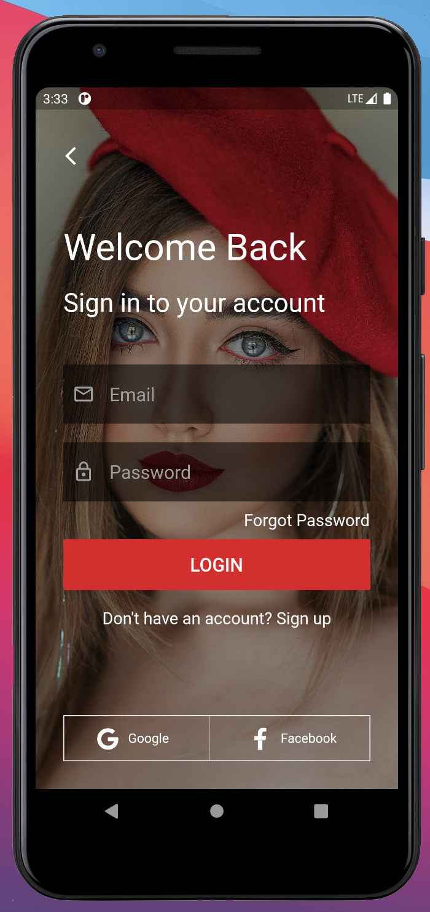
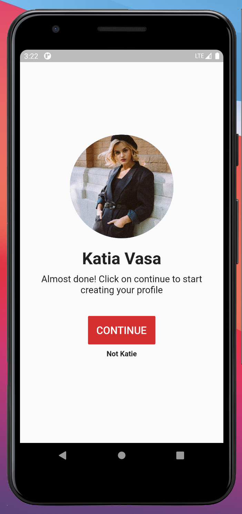

# Flutter UI | Fashion App Login UI


[](https://www.apache.org/licenses/LICENSE-2.0.html)

Login UI for Fashion App.

## Screenshots 📷

<table style="width:100%">
  <tr>
    <th>Login</th>
    <th>Overview</th>
  </tr>
  <tr>
    <td></td>
    <td></td>
  </tr>
  </table>

## Getting Started

This project is the source code of a Fashion Login UI .

A few resources to get you started if this is your first Flutter project:

- [Lab: Write your first Flutter app](https://flutter.dev/docs/get-started/codelab)
- [Cookbook: Useful Flutter samples](https://flutter.dev/docs/cookbook)

For help getting started with Flutter, view our
[online documentation](https://flutter.dev/docs), which offers tutorials,
samples, guidance on mobile development, and a full API reference.


  ## License 📄

```
    Copyright (C) TEKOMBO Gabriel

    Licensed under the Apache License, Version 2.0 (the "License");
    you may not use this file except in compliance with the License.
    You may obtain a copy of the License at

       http://www.apache.org/licenses/LICENSE-2.0

    Unless required by applicable law or agreed to in writing, software
    distributed under the License is distributed on an "AS IS" BASIS,
    WITHOUT WARRANTIES OR CONDITIONS OF ANY KIND, either express or implied.
    See the License for the specific language governing permissions and
    limitations under the License.
```
